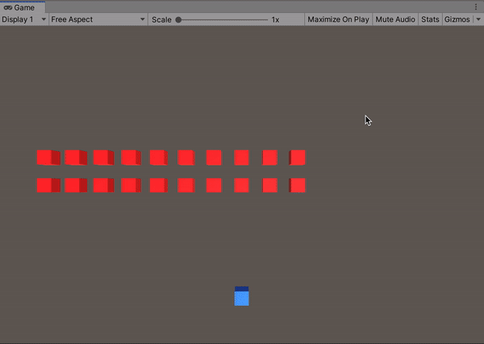
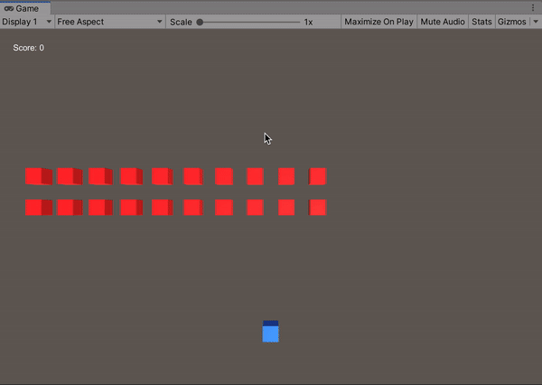
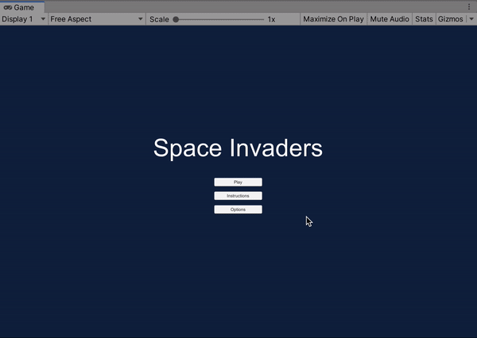
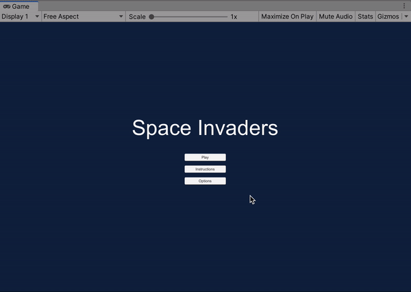
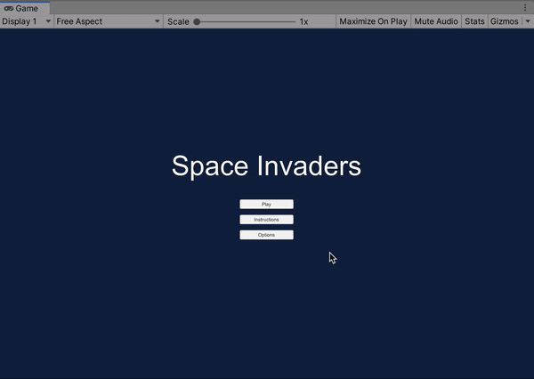
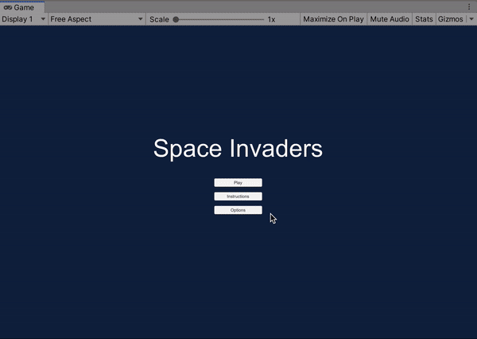

**The University of Melbourne**
# COMP30019 – Graphics and Interaction

## Workshop 9

# Introduction:

In this lab you will be extending the space invaders game from the previous lab.

# Task:

1. Change the player controls so that projectiles are fired by clicking the mouse (rather than pressing ‘space’). The projectile should be fired towards the mouse click so the player can aim. Hint: You’ll need to pick a position in the world based on the mouse click, and use the difference between this position and the player position to determine the direction for the projectile to move.

  

2. Add some text to the game which tracks the player’s score. It should increment every time the player destroys an enemy.

  

3. Add a new scene called `MainMenu.unity`. As its naming implies, this scene should contain a range of buttons the user can press to access different features:

**a.** Add a ‘Play’ button to the main menu scene. This should load the main game scene and allow the player to start playing a new game with the score reset to zero.

**b.** Add an ‘Instructions’ button to the main menu. This should open another scene with a text block of instructions. Make sure there’s a button to get back to the main menu.

**c.** Add an ‘Options’ button to the main menu. This should open another scene that allows the user to change in-game options. In particular, there should be a slider that changes the ‘difficulty’ of the game in some way (it will not do anything yet). Again, ensure there’s a way to get back to the main menu.

  

4. Implement any necessary difficulty slider logic such that it actually changes the difficulty of the game. For instance, it could make the enemies move faster. You will need to think about how data can be passed between scenes. **Important:** When you re-open the options scene, the difficulty slider should correspond to the value of the actual difficulty variable (i.e. it shouldn’t reset).

  
  

5. **Extension** Extend the game and user-interface by adding features such as enemy projectiles, player health, game ended screens and corresponding back buttons to the main menu. You may need to make some game components more generic in nature in order to do this with maximal code reuse.

  

